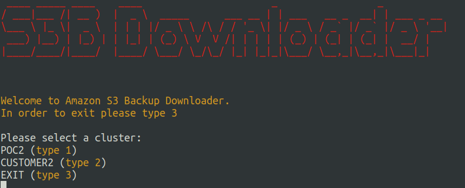

# S3 Backup Downloader

This project is for to download Amazon S3 data backup by using boto3.

Currently there are two clusters, which are POC and CUSTOMER. If you need more clusters you can add.

You can either use this by dockerize it, or directly run the script after installing the necessary python libraries

## Usage

Need to add aws access and secret key 

```python
client = boto3.client(
    's3',
    aws_access_key_id= 'ACCESS KEY ID',  # <--------- change this part
    aws_secret_access_key= 'ACCESS KEY'  # <--------- change this part
)
```
Also need to change bucket and object name. See https://docs.aws.amazon.com/AmazonS3/latest/userguide/view-bucket-properties.html

``` python
BUCKET_NAME='ENTER THE BUCKET NAME'
OBJECT_NAME= 'ENTER THE OBJECT NAME'+FILE_NAME
```
After you are done with filling empty spaces it is time to run the script!
If you have python(newer version) and pip, please go ahead. If you dont have them please install them first.
## RUN

``` shell
python -m pip install boto3
pip install pyfiglet
pip install colorama

python s3_downloader.py   (same directory)
```



